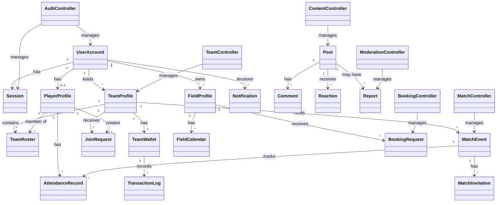

# Class Specification Design

This document provides a comprehensive specification for all classes in the **Kick-off** football management platform, derived from the planning and sequence flow documentation.

---

## Table of Contents

1. [Entity Classes](#entity-classes)
   - [UserAccount](#useraccount)
   - [Session](#session)
   - [PlayerProfile](#playerprofile)
   - [TeamProfile](#teamprofile)
   - [TeamRoster](#teamroster)
   - [JoinRequest](#joinrequest)
   - [FieldProfile](#fieldprofile)
   - [FieldCalendar](#fieldcalendar)
   - [BookingRequest](#bookingrequest)
   - [MatchEvent](#matchevent)
   - [MatchInvitation](#matchinvitation)
   - [AttendanceRecord](#attendancerecord)
   - [TeamWallet](#teamwallet)
   - [TransactionLog](#transactionlog)
   - [Post](#post)
   - [Comment](#comment)
   - [Reaction](#reaction)
   - [Report](#report)
   - [Notification](#notification)
   - [ModerationLog](#moderationlog)
   - [Content](#content)

2. [Controller Classes](#controller-classes)
   - [AuthController](#authcontroller)
   - [TeamController](#teamcontroller)
   - [TeamVerificationController](#teamverificationcontroller)
   - [FieldController](#fieldcontroller)
   - [FieldVerificationController](#fieldverificationcontroller)
   - [RosterController](#rostercontroller)
   - [MatchController](#matchcontroller)
   - [AttendanceController](#attendancecontroller)
   - [BookingController](#bookingcontroller)
   - [FinanceController](#financecontroller)
   - [PlayerController](#playercontroller)
   - [SearchController](#searchcontroller)
   - [ContentController](#contentcontroller)
   - [ModerationController](#moderationcontroller)
   - [NotificationController](#notificationcontroller)
   - [UserModerationController](#usermoderationcontroller)

3. [Service Classes](#service-classes)
   - [EmailService](#emailservice)

---

## Entity Classes

### UserAccount

**Class Description:** Represents a user account in the system, storing authentication credentials and role-based access information. Users can be Players, Team Leaders, Field Owners, or Moderators.

#### Attributes

| Attribute | Data Type | Accessibility | Description |
|-----------|-----------|---------------|-------------|
| userId | Integer | Private | Unique identifier for the user account |
| username | String | Private | Unique username for authentication |
| email | String | Private | User's email address (encrypted) |
| passwordHash | String | Private | Hashed password for secure authentication |
| role | Enum (Player, TeamLeader, FieldOwner, Moderator) | Private | User role determining access permissions |
| status | Enum (Active, Suspended, Banned, Pending) | Private | Current account status |
| isVerified | Boolean | Private | Email verification status |
| createdAt | DateTime | Private | Account creation timestamp |
| updatedAt | DateTime | Private | Last modification timestamp |
| contactInfo | String | Private | Contact information (encrypted) |
| location | String | Private | User's location (encrypted) |

#### Methods

| Method | Input Parameters | Output Type | Accessibility | Description |
|--------|------------------|-------------|---------------|-------------|
| create | username: String, email: String, password: String, role: Enum | UserAccount | Public | Creates a new user account with hashed password |
| verifyCredentials | username: String, password: String | Boolean | Public | Validates login credentials against stored hash |
| updateStatus | newStatus: Enum | Boolean | Public | Updates the account status (Active, Suspended, etc.) |
| updatePassword | newPasswordHash: String | Boolean | Public | Updates the user's password hash |
| isActive | None | Boolean | Public | Checks if the account is in active state |
| getByUsername | username: String | UserAccount | Public | Retrieves user account by username |
| getById | userId: Integer | UserAccount | Public | Retrieves user account by ID |

---

### Session

**Class Description:** Manages active user sessions for authentication state, tracking login instances and enabling secure session management.

#### Attributes

| Attribute | Data Type | Accessibility | Description |
|-----------|-----------|---------------|-------------|
| sessionId | String | Private | Unique session identifier (token) |
| userId | Integer | Private | Foreign key reference to UserAccount |
| createdAt | DateTime | Private | Session creation timestamp |
| expiresAt | DateTime | Private | Session expiration timestamp |
| ipAddress | String | Private | Client IP address |
| userAgent | String | Private | Client browser/device information |

#### Methods

| Method | Input Parameters | Output Type | Accessibility | Description |
|--------|------------------|-------------|---------------|-------------|
| create | userId: Integer | Session | Public | Creates a new session for authenticated user |
| destroy | sessionId: String | Boolean | Public | Terminates and invalidates a session |
| isValid | sessionId: String | Boolean | Public | Checks if session is still valid and not expired |
| getByUserId | userId: Integer | Session | Public | Retrieves active session for a user |

---

### PlayerProfile

**Class Description:** Stores player-specific profile information including skills, positions, and performance data for match recommendations and team management.

#### Attributes

| Attribute | Data Type | Accessibility | Description |
|-----------|-----------|---------------|-------------|
| playerId | Integer | Private | Unique identifier for the player profile |
| userId | Integer | Private | Foreign key reference to UserAccount |
| displayName | String | Private | Player's display name |
| position | String | Private | Preferred playing position (e.g., Forward, Midfielder) |
| skillLevel | Integer | Private | Skill rating for matchmaking (1-10 scale) |
| bio | String | Private | Player bio/description |
| profileImage | String | Private | URL or path to profile image |
| dateOfBirth | Date | Private | Player's date of birth |
| height | Float | Private | Player's height |
| weight | Float | Private | Player's weight |
| preferredFoot | Enum (Left, Right, Both) | Private | Dominant foot preference |
| createdAt | DateTime | Private | Profile creation timestamp |
| updatedAt | DateTime | Private | Last modification timestamp |

#### Methods

| Method | Input Parameters | Output Type | Accessibility | Description |
|--------|------------------|-------------|---------------|-------------|
| create | userId: Integer, profileData: Object | PlayerProfile | Public | Creates a new player profile |
| update | profileData: Object | Boolean | Public | Updates player profile attributes |
| getByUserId | userId: Integer | PlayerProfile | Public | Retrieves player profile by user ID |
| searchByPosition | position: String | List<PlayerProfile> | Public | Finds players by position |
| searchBySkillLevel | minSkill: Integer, maxSkill: Integer | List<PlayerProfile> | Public | Finds players within skill range |

---

### TeamProfile

**Class Description:** Represents a team entity with its profile information, verification status, and metadata. Teams are managed by Team Leaders and require moderator verification.

#### Attributes

| Attribute | Data Type | Accessibility | Description |
|-----------|-----------|---------------|-------------|
| teamId | Integer | Private | Unique identifier for the team |
| teamName | String | Private | Unique name of the team |
| description | String | Private | Team description and bio |
| logoUrl | String | Private | URL or path to team logo image |
| leaderId | Integer | Private | Foreign key reference to Team Leader's UserAccount |
| status | Enum (Pending, Verified, Rejected) | Private | Verification status of the team |
| location | String | Private | Team's home location/city |
| skillLevel | Integer | Private | Average skill level for matchmaking |
| createdAt | DateTime | Private | Team creation timestamp |
| updatedAt | DateTime | Private | Last modification timestamp |

#### Methods

| Method | Input Parameters | Output Type | Accessibility | Description |
|--------|------------------|-------------|---------------|-------------|
| create | leaderId: Integer, teamData: Object | TeamProfile | Public | Creates a new team with Pending status |
| update | teamData: Object | Boolean | Public | Updates team profile attributes |
| updateStatus | newStatus: Enum | Boolean | Public | Updates verification status |
| delete | teamId: Integer | Boolean | Public | Soft-deletes or removes team |
| getById | teamId: Integer | TeamProfile | Public | Retrieves team by ID |
| getPendingTeams | None | List<TeamProfile> | Public | Retrieves all teams with Pending status |
| searchByName | name: String | List<TeamProfile> | Public | Searches teams by name pattern |
| searchByLocation | location: String | List<TeamProfile> | Public | Searches teams by location |

---

### TeamRoster

**Class Description:** Junction entity managing the many-to-many relationship between teams and players, tracking membership status and roles within teams.

#### Attributes

| Attribute | Data Type | Accessibility | Description |
|-----------|-----------|---------------|-------------|
| rosterId | Integer | Private | Unique identifier for the roster entry |
| teamId | Integer | Private | Foreign key reference to TeamProfile |
| playerId | Integer | Private | Foreign key reference to PlayerProfile |
| role | Enum (Member, Captain, ViceCaptain) | Private | Player's role within the team |
| joinedAt | DateTime | Private | Date player joined the team |
| isActive | Boolean | Private | Whether the membership is active |

#### Methods

| Method | Input Parameters | Output Type | Accessibility | Description |
|--------|------------------|-------------|---------------|-------------|
| addPlayer | teamId: Integer, playerId: Integer, role: Enum | TeamRoster | Public | Adds a player to the team roster |
| removePlayer | teamId: Integer, playerId: Integer | Boolean | Public | Removes a player from the roster |
| getTeamMembers | teamId: Integer | List<PlayerProfile> | Public | Retrieves all players in a team |
| getPlayerTeams | playerId: Integer | List<TeamProfile> | Public | Retrieves all teams a player belongs to |
| updateRole | rosterId: Integer, newRole: Enum | Boolean | Public | Updates player's role in the team |

---

### JoinRequest

**Class Description:** Tracks player requests to join teams, enabling Team Leaders to approve or reject membership requests with status tracking.

#### Attributes

| Attribute | Data Type | Accessibility | Description |
|-----------|-----------|---------------|-------------|
| requestId | Integer | Private | Unique identifier for the join request |
| teamId | Integer | Private | Foreign key reference to TeamProfile |
| playerId | Integer | Private | Foreign key reference to PlayerProfile |
| status | Enum (Pending, Accepted, Rejected) | Private | Current status of the request |
| message | String | Private | Optional message from the player |
| createdAt | DateTime | Private | Request creation timestamp |
| processedAt | DateTime | Private | Timestamp when request was processed |

#### Methods

| Method | Input Parameters | Output Type | Accessibility | Description |
|--------|------------------|-------------|---------------|-------------|
| create | teamId: Integer, playerId: Integer, message: String | JoinRequest | Public | Creates a new join request |
| updateStatus | requestId: Integer, status: Enum | Boolean | Public | Updates request status (Accept/Reject) |
| getPendingByTeam | teamId: Integer | List<JoinRequest> | Public | Retrieves pending requests for a team |
| existsRequest | teamId: Integer, playerId: Integer | Boolean | Public | Checks if an active request already exists |
| getById | requestId: Integer | JoinRequest | Public | Retrieves request by ID |

---

### FieldProfile

**Class Description:** Represents a football field/stadium profile with details about facilities, location, pricing, and verification status. Managed by Field Owners.

#### Attributes

| Attribute | Data Type | Accessibility | Description |
|-----------|-----------|---------------|-------------|
| fieldId | Integer | Private | Unique identifier for the field |
| ownerId | Integer | Private | Foreign key reference to Field Owner's UserAccount |
| fieldName | String | Private | Name of the football field |
| description | String | Private | Description of facilities and amenities |
| location | String | Private | Physical address/location |
| latitude | Float | Private | GPS latitude coordinate |
| longitude | Float | Private | GPS longitude coordinate |
| amenities | List<String> | Private | List of available amenities |
| pricePerHour | Decimal | Private | Rental price per hour |
| capacity | Integer | Private | Maximum player capacity |
| images | List<String> | Private | URLs of field images |
| status | Enum (Pending, Verified, Rejected) | Private | Verification status |
| createdAt | DateTime | Private | Profile creation timestamp |
| updatedAt | DateTime | Private | Last modification timestamp |

#### Methods

| Method | Input Parameters | Output Type | Accessibility | Description |
|--------|------------------|-------------|---------------|-------------|
| create | ownerId: Integer, fieldData: Object | FieldProfile | Public | Creates a new field profile with Pending status |
| update | fieldData: Object | Boolean | Public | Updates field profile attributes |
| updateStatus | newStatus: Enum | Boolean | Public | Updates verification status |
| getById | fieldId: Integer | FieldProfile | Public | Retrieves field by ID |
| getByOwner | ownerId: Integer | List<FieldProfile> | Public | Retrieves all fields owned by a user |
| getPendingFields | None | List<FieldProfile> | Public | Retrieves all fields pending verification |
| searchByAmenities | amenities: List<String> | List<FieldProfile> | Public | Searches fields by amenities |
| searchByPrice | minPrice: Decimal, maxPrice: Decimal | List<FieldProfile> | Public | Searches fields within price range |
| searchByLocation | location: String | List<FieldProfile> | Public | Searches fields by location |

---

### FieldCalendar

**Class Description:** Manages availability slots for football fields, tracking booked, available, and blocked time slots for scheduling.

#### Attributes

| Attribute | Data Type | Accessibility | Description |
|-----------|-----------|---------------|-------------|
| calendarId | Integer | Private | Unique identifier for the calendar entry |
| fieldId | Integer | Private | Foreign key reference to FieldProfile |
| date | Date | Private | Date of the time slot |
| startTime | Time | Private | Start time of the slot |
| endTime | Time | Private | End time of the slot |
| status | Enum (Available, Booked, Maintenance, Blocked) | Private | Current slot status |
| bookingId | Integer | Private | Foreign key to BookingRequest if booked |

#### Methods

| Method | Input Parameters | Output Type | Accessibility | Description |
|--------|------------------|-------------|---------------|-------------|
| checkAvailability | fieldId: Integer, date: Date, startTime: Time, endTime: Time | Boolean | Public | Checks if a slot is available |
| updateStatus | calendarId: Integer, status: Enum | Boolean | Public | Updates the slot status |
| markAsBooked | calendarId: Integer, bookingId: Integer | Boolean | Public | Marks a slot as booked |
| markAsAvailable | calendarId: Integer | Boolean | Public | Releases a slot to available |
| getSlotsByField | fieldId: Integer, startDate: Date, endDate: Date | List<FieldCalendar> | Public | Retrieves slots for a field within date range |
| hasConflict | fieldId: Integer, date: Date, startTime: Time, endTime: Time | Boolean | Public | Checks for booking conflicts |

---

### BookingRequest

**Class Description:** Represents a booking request for a football field, linking teams to fields with approval workflow and status tracking.

#### Attributes

| Attribute | Data Type | Accessibility | Description |
|-----------|-----------|---------------|-------------|
| bookingId | Integer | Private | Unique identifier for the booking |
| fieldId | Integer | Private | Foreign key reference to FieldProfile |
| teamId | Integer | Private | Foreign key reference to TeamProfile |
| requesterId | Integer | Private | Foreign key to UserAccount who made the request |
| date | Date | Private | Requested booking date |
| startTime | Time | Private | Requested start time |
| endTime | Time | Private | Requested end time |
| status | Enum (Pending, Confirmed, Rejected, Cancelled) | Private | Booking status |
| notes | String | Private | Additional notes or requirements |
| createdAt | DateTime | Private | Request creation timestamp |
| processedAt | DateTime | Private | Timestamp when request was processed |

#### Methods

| Method | Input Parameters | Output Type | Accessibility | Description |
|--------|------------------|-------------|---------------|-------------|
| create | bookingData: Object | BookingRequest | Public | Creates a new booking request |
| updateStatus | bookingId: Integer, status: Enum | Boolean | Public | Updates booking status |
| getById | bookingId: Integer | BookingRequest | Public | Retrieves booking by ID |
| getPendingByField | fieldId: Integer | List<BookingRequest> | Public | Retrieves pending bookings for a field |
| getByTeam | teamId: Integer | List<BookingRequest> | Public | Retrieves bookings for a team |
| cancel | bookingId: Integer | Boolean | Public | Cancels a booking request |

---

### MatchEvent

**Class Description:** Represents a scheduled match event between teams, including venue, timing, status, and attendance tracking.

#### Attributes

| Attribute | Data Type | Accessibility | Description |
|-----------|-----------|---------------|-------------|
| matchId | Integer | Private | Unique identifier for the match |
| hostTeamId | Integer | Private | Foreign key to hosting TeamProfile |
| opponentTeamId | Integer | Private | Foreign key to opponent TeamProfile (nullable) |
| stadiumId | Integer | Private | Foreign key to Stadium/FieldProfile |
| matchDate | Date | Private | Date of the match |
| startTime | Time | Private | Match start time |
| endTime | Time | Private | Match end time |
| status | Enum (PendingApproval, Scheduled, InProgress, Completed, Cancelled) | Private | Current match status |
| visibility | Enum (Public, Private) | Private | Match visibility setting |
| description | String | Private | Match description or notes |
| createdAt | DateTime | Private | Event creation timestamp |
| updatedAt | DateTime | Private | Last modification timestamp |

#### Methods

| Method | Input Parameters | Output Type | Accessibility | Description |
|--------|------------------|-------------|---------------|-------------|
| create | matchData: Object | MatchEvent | Public | Creates a new match event |
| update | matchData: Object | Boolean | Public | Updates match event details |
| updateStatus | matchId: Integer, status: Enum | Boolean | Public | Updates match status |
| setOpponent | matchId: Integer, opponentTeamId: Integer | Boolean | Public | Assigns opponent team to match |
| getById | matchId: Integer | MatchEvent | Public | Retrieves match by ID |
| getByTeam | teamId: Integer | List<MatchEvent> | Public | Retrieves all matches for a team |
| getUpcoming | teamId: Integer | List<MatchEvent> | Public | Retrieves upcoming matches for a team |
| cancel | matchId: Integer | Boolean | Public | Cancels the match event |

---

### MatchInvitation

**Class Description:** Manages match invitations sent between teams, enabling opponent matching and response tracking.

#### Attributes

| Attribute | Data Type | Accessibility | Description |
|-----------|-----------|---------------|-------------|
| invitationId | Integer | Private | Unique identifier for the invitation |
| matchId | Integer | Private | Foreign key to MatchEvent |
| invitingTeamId | Integer | Private | Foreign key to inviting TeamProfile |
| invitedTeamId | Integer | Private | Foreign key to invited TeamProfile |
| status | Enum (Pending, Accepted, Declined, Expired) | Private | Invitation status |
| message | String | Private | Optional message with invitation |
| createdAt | DateTime | Private | Invitation creation timestamp |
| respondedAt | DateTime | Private | Response timestamp |

#### Methods

| Method | Input Parameters | Output Type | Accessibility | Description |
|--------|------------------|-------------|---------------|-------------|
| create | matchId: Integer, invitingTeamId: Integer, invitedTeamId: Integer | MatchInvitation | Public | Creates a new match invitation |
| updateStatus | invitationId: Integer, status: Enum | Boolean | Public | Updates invitation status |
| getById | invitationId: Integer | MatchInvitation | Public | Retrieves invitation by ID |
| getPendingByTeam | teamId: Integer | List<MatchInvitation> | Public | Retrieves pending invitations for a team |
| accept | invitationId: Integer | Boolean | Public | Accepts the invitation |
| decline | invitationId: Integer | Boolean | Public | Declines the invitation |

---

### AttendanceRecord

**Class Description:** Tracks player attendance for match events, enabling attendance confirmation and statistics.

#### Attributes

| Attribute | Data Type | Accessibility | Description |
|-----------|-----------|---------------|-------------|
| attendanceId | Integer | Private | Unique identifier for the record |
| matchId | Integer | Private | Foreign key to MatchEvent |
| playerId | Integer | Private | Foreign key to PlayerProfile |
| status | Enum (Pending, Present, Absent, Excused) | Private | Attendance status |
| confirmedAt | DateTime | Private | Timestamp of attendance confirmation |
| confirmedBy | Integer | Private | User who confirmed (self or Team Leader) |

#### Methods

| Method | Input Parameters | Output Type | Accessibility | Description |
|--------|------------------|-------------|---------------|-------------|
| create | matchId: Integer, playerId: Integer | AttendanceRecord | Public | Creates a new attendance record |
| updateStatus | attendanceId: Integer, status: Enum | Boolean | Public | Updates attendance status |
| getByMatch | matchId: Integer | List<AttendanceRecord> | Public | Retrieves all attendance for a match |
| getByPlayer | playerId: Integer | List<AttendanceRecord> | Public | Retrieves attendance history for a player |
| confirmPresence | matchId: Integer, playerId: Integer | Boolean | Public | Confirms player attendance |
| getStats | matchId: Integer | Object | Public | Returns attendance statistics for a match |

---

### TeamWallet

**Class Description:** Manages team financial balance and fund tracking for expense management and transparency.

#### Attributes

| Attribute | Data Type | Accessibility | Description |
|-----------|-----------|---------------|-------------|
| walletId | Integer | Private | Unique identifier for the wallet |
| teamId | Integer | Private | Foreign key to TeamProfile |
| balance | Decimal | Private | Current wallet balance |
| currency | String | Private | Currency code (e.g., VND) |
| createdAt | DateTime | Private | Wallet creation timestamp |
| updatedAt | DateTime | Private | Last balance update timestamp |

#### Methods

| Method | Input Parameters | Output Type | Accessibility | Description |
|--------|------------------|-------------|---------------|-------------|
| create | teamId: Integer | TeamWallet | Public | Creates a new wallet for a team |
| getByTeam | teamId: Integer | TeamWallet | Public | Retrieves wallet by team ID |
| updateBalance | walletId: Integer, amount: Decimal | Boolean | Public | Updates the wallet balance |
| getBalance | walletId: Integer | Decimal | Public | Returns current balance |
| addFunds | walletId: Integer, amount: Decimal | Boolean | Public | Adds funds to wallet |
| deductFunds | walletId: Integer, amount: Decimal | Boolean | Public | Deducts funds from wallet |

---

### TransactionLog

**Class Description:** Records all financial transactions for a team wallet, providing audit trail and expense tracking.

#### Attributes

| Attribute | Data Type | Accessibility | Description |
|-----------|-----------|---------------|-------------|
| transactionId | Integer | Private | Unique identifier for the transaction |
| walletId | Integer | Private | Foreign key to TeamWallet |
| type | Enum (Income, Expense) | Private | Transaction type |
| amount | Decimal | Private | Transaction amount |
| description | String | Private | Transaction description |
| category | String | Private | Transaction category (e.g., Field Rental, Equipment) |
| createdBy | Integer | Private | Foreign key to UserAccount who created entry |
| createdAt | DateTime | Private | Transaction creation timestamp |

#### Methods

| Method | Input Parameters | Output Type | Accessibility | Description |
|--------|------------------|-------------|---------------|-------------|
| create | walletId: Integer, transactionData: Object | TransactionLog | Public | Creates a new transaction entry |
| getByWallet | walletId: Integer | List<TransactionLog> | Public | Retrieves all transactions for a wallet |
| getByDateRange | walletId: Integer, startDate: Date, endDate: Date | List<TransactionLog> | Public | Retrieves transactions within date range |
| getByType | walletId: Integer, type: Enum | List<TransactionLog> | Public | Retrieves transactions by type |
| getSummary | walletId: Integer | Object | Public | Returns income/expense summary |

---

### Post

**Class Description:** Represents a community post created by users, supporting social interaction and content sharing.

#### Attributes

| Attribute | Data Type | Accessibility | Description |
|-----------|-----------|---------------|-------------|
| postId | Integer | Private | Unique identifier for the post |
| authorId | Integer | Private | Foreign key to UserAccount |
| content | String | Private | Post text content |
| images | List<String> | Private | URLs of attached images |
| visibility | Enum (Public, Private, TeamOnly) | Private | Post visibility setting |
| reactionCount | Integer | Private | Total number of reactions |
| commentCount | Integer | Private | Total number of comments |
| isHidden | Boolean | Private | Whether post is hidden by moderation |
| createdAt | DateTime | Private | Post creation timestamp |
| updatedAt | DateTime | Private | Last modification timestamp |

#### Methods

| Method | Input Parameters | Output Type | Accessibility | Description |
|--------|------------------|-------------|---------------|-------------|
| create | authorId: Integer, postData: Object | Post | Public | Creates a new post |
| update | postId: Integer, postData: Object | Boolean | Public | Updates post content |
| delete | postId: Integer | Boolean | Public | Deletes or hides a post |
| getById | postId: Integer | Post | Public | Retrieves post by ID |
| getPublicFeed | limit: Integer, offset: Integer | List<Post> | Public | Retrieves public posts for feed |
| getByAuthor | authorId: Integer | List<Post> | Public | Retrieves posts by author |
| incrementReactionCount | postId: Integer | Boolean | Public | Increments reaction counter |
| incrementCommentCount | postId: Integer | Boolean | Public | Increments comment counter |
| setVisibility | postId: Integer, isHidden: Boolean | Boolean | Public | Sets hidden status for moderation |

---

### Comment

**Class Description:** Represents a comment on a post, enabling threaded discussions and social interaction.

#### Attributes

| Attribute | Data Type | Accessibility | Description |
|-----------|-----------|---------------|-------------|
| commentId | Integer | Private | Unique identifier for the comment |
| postId | Integer | Private | Foreign key to Post |
| authorId | Integer | Private | Foreign key to UserAccount |
| content | String | Private | Comment text content |
| parentCommentId | Integer | Private | Foreign key for nested replies (nullable) |
| isHidden | Boolean | Private | Whether comment is hidden by moderation |
| createdAt | DateTime | Private | Comment creation timestamp |
| updatedAt | DateTime | Private | Last modification timestamp |

#### Methods

| Method | Input Parameters | Output Type | Accessibility | Description |
|--------|------------------|-------------|---------------|-------------|
| create | postId: Integer, authorId: Integer, content: String | Comment | Public | Creates a new comment |
| update | commentId: Integer, content: String | Boolean | Public | Updates comment content |
| delete | commentId: Integer | Boolean | Public | Deletes or hides a comment |
| getByPost | postId: Integer | List<Comment> | Public | Retrieves all comments for a post |
| getReplies | commentId: Integer | List<Comment> | Public | Retrieves replies to a comment |
| setVisibility | commentId: Integer, isHidden: Boolean | Boolean | Public | Sets hidden status for moderation |

---

### Reaction

**Class Description:** Represents a user reaction (like) on a post, tracking engagement and preventing duplicate reactions.

#### Attributes

| Attribute | Data Type | Accessibility | Description |
|-----------|-----------|---------------|-------------|
| reactionId | Integer | Private | Unique identifier for the reaction |
| postId | Integer | Private | Foreign key to Post |
| userId | Integer | Private | Foreign key to UserAccount |
| type | Enum (Like, Love, Celebrate) | Private | Type of reaction |
| createdAt | DateTime | Private | Reaction creation timestamp |

#### Methods

| Method | Input Parameters | Output Type | Accessibility | Description |
|--------|------------------|-------------|---------------|-------------|
| create | postId: Integer, userId: Integer, type: Enum | Reaction | Public | Creates a new reaction |
| delete | reactionId: Integer | Boolean | Public | Removes a reaction |
| exists | postId: Integer, userId: Integer | Boolean | Public | Checks if user already reacted |
| getByPost | postId: Integer | List<Reaction> | Public | Retrieves all reactions for a post |
| toggle | postId: Integer, userId: Integer, type: Enum | Boolean | Public | Toggles reaction on/off |

---

### Report

**Class Description:** Represents a misconduct report submitted by users, enabling content moderation and community safety.

#### Attributes

| Attribute | Data Type | Accessibility | Description |
|-----------|-----------|---------------|-------------|
| reportId | Integer | Private | Unique identifier for the report |
| reporterId | Integer | Private | Foreign key to reporting UserAccount |
| reportedUserId | Integer | Private | Foreign key to reported UserAccount |
| contentId | Integer | Private | Foreign key to Content (Post/Comment) |
| contentType | Enum (Post, Comment, User) | Private | Type of content being reported |
| reason | String | Private | Reason for the report |
| details | String | Private | Additional details provided |
| status | Enum (Pending, Resolved, Dismissed) | Private | Report status |
| createdAt | DateTime | Private | Report creation timestamp |
| resolvedAt | DateTime | Private | Resolution timestamp |

#### Methods

| Method | Input Parameters | Output Type | Accessibility | Description |
|--------|------------------|-------------|---------------|-------------|
| create | reportData: Object | Report | Public | Creates a new report |
| updateStatus | reportId: Integer, status: Enum | Boolean | Public | Updates report status |
| getById | reportId: Integer | Report | Public | Retrieves report by ID |
| getPending | None | List<Report> | Public | Retrieves all pending reports |
| getByReporter | reporterId: Integer | List<Report> | Public | Retrieves reports by a user |
| resolve | reportId: Integer | Boolean | Public | Marks report as resolved |
| dismiss | reportId: Integer | Boolean | Public | Dismisses the report |

---

### Notification

**Class Description:** Represents a notification sent to users for various system events, enabling real-time updates and alerts.

#### Attributes

| Attribute | Data Type | Accessibility | Description |
|-----------|-----------|---------------|-------------|
| notificationId | Integer | Private | Unique identifier for the notification |
| userId | Integer | Private | Foreign key to recipient UserAccount |
| type | Enum (TeamVerified, JoinRequest, MatchInvite, BookingUpdate, etc.) | Private | Notification type |
| title | String | Private | Notification title |
| message | String | Private | Notification message content |
| relatedEntityId | Integer | Private | ID of related entity (match, team, etc.) |
| relatedEntityType | String | Private | Type of related entity |
| isRead | Boolean | Private | Read status |
| createdAt | DateTime | Private | Creation timestamp |

#### Methods

| Method | Input Parameters | Output Type | Accessibility | Description |
|--------|------------------|-------------|---------------|-------------|
| create | userId: Integer, notificationData: Object | Notification | Public | Creates a new notification |
| markAsRead | notificationId: Integer | Boolean | Public | Marks notification as read |
| getByUser | userId: Integer | List<Notification> | Public | Retrieves notifications for a user |
| getUnread | userId: Integer | List<Notification> | Public | Retrieves unread notifications |
| delete | notificationId: Integer | Boolean | Public | Deletes a notification |
| markAllAsRead | userId: Integer | Boolean | Public | Marks all user notifications as read |

---

### ModerationLog

**Class Description:** Records all moderation actions taken by moderators for audit trail and accountability.

#### Attributes

| Attribute | Data Type | Accessibility | Description |
|-----------|-----------|---------------|-------------|
| logId | Integer | Private | Unique identifier for the log entry |
| moderatorId | Integer | Private | Foreign key to Moderator's UserAccount |
| targetUserId | Integer | Private | Foreign key to affected UserAccount |
| action | Enum (Suspend, Ban, Reactivate, ContentRemoval, Warning) | Private | Action taken |
| reason | String | Private | Reason for the action |
| details | String | Private | Additional action details |
| createdAt | DateTime | Private | Log creation timestamp |

#### Methods

| Method | Input Parameters | Output Type | Accessibility | Description |
|--------|------------------|-------------|---------------|-------------|
| create | moderatorId: Integer, logData: Object | ModerationLog | Public | Creates a new moderation log entry |
| getByModerator | moderatorId: Integer | List<ModerationLog> | Public | Retrieves logs by moderator |
| getByUser | userId: Integer | List<ModerationLog> | Public | Retrieves moderation history for a user |
| getByAction | action: Enum | List<ModerationLog> | Public | Retrieves logs by action type |

---

### Content

**Class Description:** Abstract representation of content entities (Post/Comment) for unified content management and moderation.

#### Attributes

| Attribute | Data Type | Accessibility | Description |
|-----------|-----------|---------------|-------------|
| contentId | Integer | Private | Unique identifier for the content |
| type | Enum (Post, Comment) | Private | Content type |
| authorId | Integer | Private | Foreign key to UserAccount |
| isHidden | Boolean | Private | Whether content is hidden/deleted |
| createdAt | DateTime | Private | Creation timestamp |

#### Methods

| Method | Input Parameters | Output Type | Accessibility | Description |
|--------|------------------|-------------|---------------|-------------|
| hide | contentId: Integer | Boolean | Public | Hides content from public view |
| restore | contentId: Integer | Boolean | Public | Restores hidden content |
| getById | contentId: Integer | Content | Public | Retrieves content by ID |
| setVisibility | contentId: Integer, isHidden: Boolean | Boolean | Public | Sets content visibility |

---

## Controller Classes

### AuthController

**Class Description:** Handles all authentication-related operations including user registration, login, logout, password management, and session handling.

#### Attributes

| Attribute | Data Type | Accessibility | Description |
|-----------|-----------|---------------|-------------|
| userRepository | UserAccountRepository | Private | Repository for UserAccount operations |
| sessionRepository | SessionRepository | Private | Repository for Session operations |
| emailService | EmailService | Private | Service for sending emails |

#### Methods

| Method | Input Parameters | Output Type | Accessibility | Description |
|--------|------------------|-------------|---------------|-------------|
| register | username: String, email: String, password: String, role: Enum | UserAccount | Public | Registers a new user account |
| login | username: String, password: String | Session | Public | Authenticates user and creates session |
| logout | sessionId: String | Boolean | Public | Terminates user session |
| changePassword | userId: Integer, currentPassword: String, newPassword: String | Boolean | Public | Changes user password |
| validateInput | inputData: Object | Boolean | Private | Validates registration/login input |
| hashPassword | password: String | String | Private | Hashes password for storage |
| verifyPassword | password: String, hash: String | Boolean | Private | Verifies password against hash |
| sendVerificationEmail | email: String, token: String | Boolean | Private | Sends email verification |

---

### TeamController

**Class Description:** Manages team-related operations including profile CRUD, join request handling, and team deletion.

#### Attributes

| Attribute | Data Type | Accessibility | Description |
|-----------|-----------|---------------|-------------|
| teamRepository | TeamProfileRepository | Private | Repository for TeamProfile operations |
| rosterRepository | TeamRosterRepository | Private | Repository for TeamRoster operations |
| joinRequestRepository | JoinRequestRepository | Private | Repository for JoinRequest operations |
| notificationController | NotificationController | Private | Controller for sending notifications |

#### Methods

| Method | Input Parameters | Output Type | Accessibility | Description |
|--------|------------------|-------------|---------------|-------------|
| createTeam | leaderId: Integer, teamData: Object | TeamProfile | Public | Creates a new team profile |
| updateTeam | teamId: Integer, teamData: Object | Boolean | Public | Updates team profile |
| deleteTeam | teamId: Integer | Boolean | Public | Deletes a team and notifies members |
| processJoinRequest | requestId: Integer, approve: Boolean | Boolean | Public | Approves or rejects join request |
| handleLeaveTeam | teamId: Integer, playerId: Integer | Boolean | Public | Handles player leaving team |
| validateTeamData | teamData: Object | Boolean | Private | Validates team profile data |
| checkNameUniqueness | teamName: String | Boolean | Private | Checks if team name is unique |
| notifyMembers | teamId: Integer, message: String | Boolean | Private | Notifies all team members |

---

### TeamVerificationController

**Class Description:** Handles moderator verification of team profiles, managing approval and rejection workflows.

#### Attributes

| Attribute | Data Type | Accessibility | Description |
|-----------|-----------|---------------|-------------|
| teamRepository | TeamProfileRepository | Private | Repository for TeamProfile operations |
| notificationController | NotificationController | Private | Controller for sending notifications |

#### Methods

| Method | Input Parameters | Output Type | Accessibility | Description |
|--------|------------------|-------------|---------------|-------------|
| getPendingTeams | None | List<TeamProfile> | Public | Retrieves teams pending verification |
| approveTeam | teamId: Integer | Boolean | Public | Approves a team profile |
| rejectTeam | teamId: Integer, reason: String | Boolean | Public | Rejects a team profile with reason |
| validateRequest | moderatorId: Integer, teamId: Integer | Boolean | Private | Validates verification request |

---

### FieldController

**Class Description:** Manages field profile operations including creation, updates, and field owner management.

#### Attributes

| Attribute | Data Type | Accessibility | Description |
|-----------|-----------|---------------|-------------|
| fieldRepository | FieldProfileRepository | Private | Repository for FieldProfile operations |
| notificationController | NotificationController | Private | Controller for sending notifications |

#### Methods

| Method | Input Parameters | Output Type | Accessibility | Description |
|--------|------------------|-------------|---------------|-------------|
| createField | ownerId: Integer, fieldData: Object | FieldProfile | Public | Creates a new field profile |
| updateField | fieldId: Integer, fieldData: Object | Boolean | Public | Updates field profile |
| validateFieldData | fieldData: Object | Boolean | Private | Validates field profile data |
| checkCriticalChanges | originalField: FieldProfile, newData: Object | Boolean | Private | Checks if critical fields changed requiring re-verification |
| notifyModerator | fieldId: Integer, action: String | Boolean | Private | Notifies moderator of pending verification |

---

### FieldVerificationController

**Class Description:** Handles moderator verification of field profiles, managing approval and rejection workflows.

#### Attributes

| Attribute | Data Type | Accessibility | Description |
|-----------|-----------|---------------|-------------|
| fieldRepository | FieldProfileRepository | Private | Repository for FieldProfile operations |
| notificationController | NotificationController | Private | Controller for sending notifications |

#### Methods

| Method | Input Parameters | Output Type | Accessibility | Description |
|--------|------------------|-------------|---------------|-------------|
| getPendingFields | None | List<FieldProfile> | Public | Retrieves fields pending verification |
| approveField | fieldId: Integer | Boolean | Public | Approves a field profile |
| rejectField | fieldId: Integer, reason: String | Boolean | Public | Rejects a field profile with reason |
| validateRequest | moderatorId: Integer, fieldId: Integer | Boolean | Private | Validates verification request |

---

### RosterController

**Class Description:** Manages team roster operations including adding, removing, and updating player memberships.

#### Attributes

| Attribute | Data Type | Accessibility | Description |
|-----------|-----------|---------------|-------------|
| rosterRepository | TeamRosterRepository | Private | Repository for TeamRoster operations |
| notificationController | NotificationController | Private | Controller for sending notifications |

#### Methods

| Method | Input Parameters | Output Type | Accessibility | Description |
|--------|------------------|-------------|---------------|-------------|
| getTeamRoster | teamId: Integer | List<PlayerProfile> | Public | Retrieves all players in a team |
| addPlayer | teamId: Integer, playerId: Integer, role: Enum | Boolean | Public | Adds a player to the roster |
| removePlayer | teamId: Integer, playerId: Integer | Boolean | Public | Removes a player from the roster |
| updatePlayerRole | rosterId: Integer, newRole: Enum | Boolean | Public | Updates player's role in team |
| notifyPlayer | playerId: Integer, message: String | Boolean | Private | Notifies player of roster changes |

---

### MatchController

**Class Description:** Manages match event operations including creation, cancellation, invitations, and match schedule retrieval.

#### Attributes

| Attribute | Data Type | Accessibility | Description |
|-----------|-----------|---------------|-------------|
| matchRepository | MatchEventRepository | Private | Repository for MatchEvent operations |
| invitationRepository | MatchInvitationRepository | Private | Repository for MatchInvitation operations |
| stadiumRepository | FieldProfileRepository | Private | Repository for checking stadium availability |
| notificationController | NotificationController | Private | Controller for sending notifications |

#### Methods

| Method | Input Parameters | Output Type | Accessibility | Description |
|--------|------------------|-------------|---------------|-------------|
| createMatch | matchData: Object | MatchEvent | Public | Creates a new match event |
| cancelMatch | matchId: Integer | Boolean | Public | Cancels a match event |
| processInvitationResponse | invitationId: Integer, accept: Boolean | Boolean | Public | Handles invitation acceptance/decline |
| getMatchesByTeam | teamId: Integer | List<MatchEvent> | Public | Retrieves matches for a team |
| getMatchDetails | matchId: Integer | MatchEvent | Public | Retrieves detailed match information |
| checkStadiumAvailability | stadiumId: Integer, date: Date, time: Time | Boolean | Private | Checks stadium availability |
| sendInvitation | matchId: Integer, invitedTeamId: Integer | Boolean | Public | Sends match invitation to a team |
| checkPermission | userId: Integer, matchId: Integer | Boolean | Private | Checks user permission to view match |

---

### AttendanceController

**Class Description:** Manages attendance tracking for match events, enabling Team Leaders and Players to confirm attendance.

#### Attributes

| Attribute | Data Type | Accessibility | Description |
|-----------|-----------|---------------|-------------|
| attendanceRepository | AttendanceRecordRepository | Private | Repository for AttendanceRecord operations |
| matchRepository | MatchEventRepository | Private | Repository for MatchEvent operations |

#### Methods

| Method | Input Parameters | Output Type | Accessibility | Description |
|--------|------------------|-------------|---------------|-------------|
| getMatchAttendance | matchId: Integer | List<AttendanceRecord> | Public | Retrieves attendance for a match |
| updateAttendance | matchId: Integer, playerId: Integer, status: Enum | Boolean | Public | Updates player attendance status |
| confirmSelfAttendance | matchId: Integer, playerId: Integer | Boolean | Public | Player confirms own attendance |
| saveAttendanceBatch | matchId: Integer, attendanceList: List<Object> | Boolean | Public | Saves multiple attendance records |
| getAttendanceStats | matchId: Integer | Object | Public | Returns attendance statistics |
| createRecord | matchId: Integer, playerId: Integer | AttendanceRecord | Private | Creates new attendance record |

---

### BookingController

**Class Description:** Manages field booking operations including requests, approvals, rejections, and calendar management.

#### Attributes

| Attribute | Data Type | Accessibility | Description |
|-----------|-----------|---------------|-------------|
| bookingRepository | BookingRequestRepository | Private | Repository for BookingRequest operations |
| calendarRepository | FieldCalendarRepository | Private | Repository for FieldCalendar operations |
| notificationController | NotificationController | Private | Controller for sending notifications |

#### Methods

| Method | Input Parameters | Output Type | Accessibility | Description |
|--------|------------------|-------------|---------------|-------------|
| createBooking | bookingData: Object | BookingRequest | Public | Creates a new booking request |
| approveBooking | bookingId: Integer | Boolean | Public | Approves a booking request |
| rejectBooking | bookingId: Integer, reason: String | Boolean | Public | Rejects a booking request |
| cancelBooking | bookingId: Integer | Boolean | Public | Cancels a booking |
| getPendingByField | fieldId: Integer | List<BookingRequest> | Public | Retrieves pending bookings for a field |
| getCalendar | fieldId: Integer, startDate: Date, endDate: Date | List<FieldCalendar> | Public | Retrieves calendar slots |
| blockSlot | fieldId: Integer, slotData: Object | Boolean | Public | Blocks a calendar slot |
| checkConflict | fieldId: Integer, date: Date, startTime: Time, endTime: Time | Boolean | Private | Checks for booking conflicts |

---

### FinanceController

**Class Description:** Manages team financial operations including wallet balance updates and transaction logging.

#### Attributes

| Attribute | Data Type | Accessibility | Description |
|-----------|-----------|---------------|-------------|
| walletRepository | TeamWalletRepository | Private | Repository for TeamWallet operations |
| transactionRepository | TransactionLogRepository | Private | Repository for TransactionLog operations |

#### Methods

| Method | Input Parameters | Output Type | Accessibility | Description |
|--------|------------------|-------------|---------------|-------------|
| getTeamWallet | teamId: Integer | TeamWallet | Public | Retrieves team wallet information |
| addTransaction | walletId: Integer, transactionData: Object | TransactionLog | Public | Adds a new transaction |
| getTransactionHistory | walletId: Integer, filters: Object | List<TransactionLog> | Public | Retrieves transaction history |
| getFinanceSummary | walletId: Integer | Object | Public | Returns financial summary |
| validateTransaction | transactionData: Object | Boolean | Private | Validates transaction data |
| updateBalance | walletId: Integer, amount: Decimal, operation: Enum | Boolean | Private | Updates wallet balance |

---

### PlayerController

**Class Description:** Manages player profile operations including profile updates and player-specific functions.

#### Attributes

| Attribute | Data Type | Accessibility | Description |
|-----------|-----------|---------------|-------------|
| playerRepository | PlayerProfileRepository | Private | Repository for PlayerProfile operations |

#### Methods

| Method | Input Parameters | Output Type | Accessibility | Description |
|--------|------------------|-------------|---------------|-------------|
| getPlayerProfile | userId: Integer | PlayerProfile | Public | Retrieves player profile |
| updateProfile | playerId: Integer, profileData: Object | Boolean | Public | Updates player profile |
| validateProfileData | profileData: Object | Boolean | Private | Validates profile data |

---

### SearchController

**Class Description:** Handles search operations across teams, fields, players, and field owners with filtering capabilities.

#### Attributes

| Attribute | Data Type | Accessibility | Description |
|-----------|-----------|---------------|-------------|
| teamRepository | TeamProfileRepository | Private | Repository for TeamProfile operations |
| fieldRepository | FieldProfileRepository | Private | Repository for FieldProfile operations |
| playerRepository | PlayerProfileRepository | Private | Repository for PlayerProfile operations |
| userRepository | UserAccountRepository | Private | Repository for UserAccount operations |

#### Methods

| Method | Input Parameters | Output Type | Accessibility | Description |
|--------|------------------|-------------|---------------|-------------|
| searchTeams | query: String, filters: Object | List<TeamProfile> | Public | Searches for teams |
| searchFields | query: String, filters: Object | List<FieldProfile> | Public | Searches for fields |
| searchPlayers | query: String, filters: Object | List<PlayerProfile> | Public | Searches for players |
| searchFieldOwners | query: String, filters: Object | List<UserAccount> | Public | Searches for field owners |
| buildQuery | query: String, entityType: Enum | Object | Private | Builds search query |
| applyFilters | results: List, filters: Object | List | Private | Applies filters to results |

---

### ContentController

**Class Description:** Manages community content operations including posts, comments, and reactions.

#### Attributes

| Attribute | Data Type | Accessibility | Description |
|-----------|-----------|---------------|-------------|
| postRepository | PostRepository | Private | Repository for Post operations |
| commentRepository | CommentRepository | Private | Repository for Comment operations |
| reactionRepository | ReactionRepository | Private | Repository for Reaction operations |
| notificationController | NotificationController | Private | Controller for sending notifications |

#### Methods

| Method | Input Parameters | Output Type | Accessibility | Description |
|--------|------------------|-------------|---------------|-------------|
| createPost | authorId: Integer, postData: Object | Post | Public | Creates a new post |
| getPublicFeed | limit: Integer, offset: Integer | List<Post> | Public | Retrieves public content feed |
| addComment | postId: Integer, authorId: Integer, content: String | Comment | Public | Adds a comment to a post |
| toggleReaction | postId: Integer, userId: Integer, type: Enum | Boolean | Public | Toggles reaction on/off |
| validateContent | content: String | Boolean | Private | Validates content (length, profanity) |
| notifyAuthor | postId: Integer, action: String | Boolean | Private | Notifies post author of activity |

---

### ModerationController

**Class Description:** Handles content moderation operations including report processing and content visibility management.

#### Attributes

| Attribute | Data Type | Accessibility | Description |
|-----------|-----------|---------------|-------------|
| reportRepository | ReportRepository | Private | Repository for Report operations |
| contentRepository | ContentRepository | Private | Repository for Content operations |
| notificationController | NotificationController | Private | Controller for sending notifications |

#### Methods

| Method | Input Parameters | Output Type | Accessibility | Description |
|--------|------------------|-------------|---------------|-------------|
| createReport | reportData: Object | Report | Public | Creates a new misconduct report |
| getPendingReports | None | List<Report> | Public | Retrieves all pending reports |
| getReportDetails | reportId: Integer | Report | Public | Retrieves detailed report information |
| resolveReport | reportId: Integer, action: Enum | Boolean | Public | Resolves a report with action |
| dismissReport | reportId: Integer | Boolean | Public | Dismisses a report |
| removeContent | contentId: Integer | Boolean | Public | Removes/hides reported content |
| notifyParties | reportId: Integer, action: Enum | Boolean | Private | Notifies reporter and reported user |

---

### NotificationController

**Class Description:** Manages notification creation, delivery, and user notification preferences.

#### Attributes

| Attribute | Data Type | Accessibility | Description |
|-----------|-----------|---------------|-------------|
| notificationRepository | NotificationRepository | Private | Repository for Notification operations |
| userProfileRepository | UserProfileRepository | Private | Repository for user preferences |

#### Methods

| Method | Input Parameters | Output Type | Accessibility | Description |
|--------|------------------|-------------|---------------|-------------|
| createNotification | userId: Integer, notificationData: Object | Notification | Public | Creates and sends a notification |
| getUserNotifications | userId: Integer | List<Notification> | Public | Retrieves user's notifications |
| markAsRead | notificationId: Integer | Boolean | Public | Marks notification as read |
| markAllAsRead | userId: Integer | Boolean | Public | Marks all notifications as read |
| updatePreferences | userId: Integer, preferences: Object | Boolean | Public | Updates notification preferences |
| push | notification: Notification | Boolean | Private | Pushes notification to user interface |
| checkPreferences | userId: Integer, notificationType: Enum | Boolean | Private | Checks if user wants this notification type |

---

### UserModerationController

**Class Description:** Handles user account moderation including suspension, banning, and reactivation with audit logging.

#### Attributes

| Attribute | Data Type | Accessibility | Description |
|-----------|-----------|---------------|-------------|
| userRepository | UserAccountRepository | Private | Repository for UserAccount operations |
| moderationLogRepository | ModerationLogRepository | Private | Repository for ModerationLog operations |
| notificationController | NotificationController | Private | Controller for sending notifications |

#### Methods

| Method | Input Parameters | Output Type | Accessibility | Description |
|--------|------------------|-------------|---------------|-------------|
| getUserDetails | userId: Integer | UserAccount | Public | Retrieves user account details |
| suspendUser | userId: Integer, reason: String | Boolean | Public | Suspends a user account |
| banUser | userId: Integer, reason: String | Boolean | Public | Permanently bans a user account |
| reactivateUser | userId: Integer, reason: String | Boolean | Public | Reactivates a suspended account |
| getUserHistory | userId: Integer | List<ModerationLog> | Public | Retrieves user's moderation history |
| logAction | moderatorId: Integer, targetUserId: Integer, action: Enum, reason: String | ModerationLog | Private | Logs moderation action |
| notifyUser | userId: Integer, action: Enum, reason: String | Boolean | Private | Notifies user of account action |

---

## Service Classes

### EmailService

**Class Description:** External service for sending emails including verification, password reset, and notification emails.

#### Attributes

| Attribute | Data Type | Accessibility | Description |
|-----------|-----------|---------------|-------------|
| smtpHost | String | Private | SMTP server hostname |
| smtpPort | Integer | Private | SMTP server port |
| senderEmail | String | Private | Sender email address |
| senderName | String | Private | Sender display name |

#### Methods

| Method | Input Parameters | Output Type | Accessibility | Description |
|--------|------------------|-------------|---------------|-------------|
| sendVerificationEmail | email: String, verificationToken: String | Boolean | Public | Sends email verification link |
| sendPasswordResetEmail | email: String, resetToken: String | Boolean | Public | Sends password reset link |
| sendNotificationEmail | email: String, subject: String, body: String | Boolean | Public | Sends general notification email |
| buildEmailTemplate | templateName: String, data: Object | String | Private | Builds email from template |
| send | to: String, subject: String, body: String | Boolean | Private | Sends email via SMTP |

---

## Class Relationships Summary

