# Database Design Document

This document provides a comprehensive database design specification for the **Kick-off** football management platform.

---

## Table of Contents

1. [Database Tables Overview](#database-tables-overview)
2. [Entity Relationship Summary](#entity-relationship-summary)
3. [Table Specifications](#table-specifications)
4. [Design Notes](#design-notes)

---

## Database Tables Overview

| Table Name | Description |
|------------|-------------|
| `UserAccount` | Stores user authentication credentials, roles, and account status. |
| `Session` | Manages active user sessions for authentication and security. |
| `PlayerProfile` | Contains player-specific profile information, skills, and preferences. |
| `TeamProfile` | Represents team entities with profile information and verification status. |
| `TeamRoster` | Junction table managing team-player membership relationships. |
| `JoinRequest` | Tracks player requests to join teams with approval workflow. |
| `FieldProfile` | Stores football field/stadium profiles with location and pricing. |
| `FieldCalendar` | Manages field availability slots for scheduling. |
| `BookingRequest` | Represents booking requests linking teams to fields. |
| `MatchEvent` | Stores scheduled match events between teams. |
| `MatchInvitation` | Manages match invitations sent between teams. |
| `AttendanceRecord` | Tracks player attendance for match events. |
| `TeamWallet` | Manages team financial balance and fund tracking. |
| `TransactionLog` | Records all financial transactions for team wallets. |
| `Post` | Represents community posts created by users. |
| `Comment` | Stores comments on posts for threaded discussions. |
| `Reaction` | Tracks user reactions (likes) on posts. |
| `Report` | Stores misconduct reports submitted by users. |
| `Notification` | Manages notifications sent to users for system events. |
| `NotificationPreference` | Stores user preferences for notification types. |
| `MatchResult` | Records final outcomes of completed matches. |
| `Amenity` | Lookup table for field amenity types. |
| `FieldAmenity` | Junction table linking fields to amenities. |
| `FieldPricingRule` | Stores time-based pricing rules for fields (peak, off-peak, weekends). |
| `CancellationPolicy` | Stores cancellation rules and penalties for fields. |
| `MediaAsset` | Manages uploaded media files (images, videos). |
| `ModerationLog` | Records moderation actions for audit trail. |

---

## Entity Relationship Summary

```mermaid
erDiagram
    UserAccount ||--o{ Session : "has"
    UserAccount |o--|| PlayerProfile : "has"
    UserAccount ||--o{ TeamProfile : "leads"
    UserAccount ||--o{ FieldProfile : "owns"
    UserAccount ||--o{ Post : "creates"
    UserAccount ||--o{ Comment : "writes"
    UserAccount ||--o{ Reaction : "gives"
    UserAccount ||--o{ Report : "submits"
    UserAccount ||--o{ Notification : "receives"
    UserAccount ||--o{ NotificationPreference : "configures"
    UserAccount ||--o{ ModerationLog : "performs/receives"
    
    PlayerProfile ||--o{ TeamRoster : "belongs to"
    PlayerProfile ||--o{ JoinRequest : "requests"
    PlayerProfile ||--o{ AttendanceRecord : "attends"
    
    TeamProfile ||--o{ TeamRoster : "contains"
    TeamProfile ||--o{ JoinRequest : "receives"
    TeamProfile ||--|| TeamWallet : "has"
    TeamProfile ||--o{ MatchEvent : "hosts/joins"
    TeamProfile ||--o{ MatchInvitation : "sends/receives"
    TeamProfile ||--o{ BookingRequest : "makes"
    TeamProfile ||--o{ MediaAsset : "has images"
    
    FieldProfile ||--o{ FieldCalendar : "has"
    FieldProfile ||--o{ BookingRequest : "receives"
    FieldProfile ||--o{ MatchEvent : "hosts"
    FieldProfile ||--o{ FieldAmenity : "has"
    FieldProfile ||--o{ FieldPricingRule : "has pricing"
    FieldProfile ||--o| CancellationPolicy : "has policy"
    FieldProfile ||--o{ MediaAsset : "has images"
    
    Amenity ||--o{ FieldAmenity : "assigned to"
    
    FieldCalendar ||--o| BookingRequest : "linked to"
    
    MatchEvent ||--o{ MatchInvitation : "has"
    MatchEvent ||--o{ AttendanceRecord : "tracks"
    MatchEvent ||--o| MatchResult : "has"
    MatchEvent ||--o| BookingRequest : "linked to"
    
    TeamWallet ||--o{ TransactionLog : "records"
    
    Post ||--o{ Comment : "has"
    Post ||--o{ Reaction : "receives"
    Post ||--o{ MediaAsset : "has media"
    Comment ||--o{ Comment : "has replies"
    Comment ||--o{ Reaction : "receives"
    
    TeamProfile ||--o{ Post : "has team posts"
    
    PlayerProfile ||--o{ MediaAsset : "has images"
```

### Key Relationships

| Relationship | Type | Description |
|--------------|------|-------------|
| UserAccount → PlayerProfile | 1:1 | Each user can have one player profile |
| UserAccount → TeamProfile | 1:N | A user (Team Leader) can lead multiple teams |
| UserAccount → FieldProfile | 1:N | A user (Field Owner) can own multiple fields |
| TeamProfile → TeamRoster | 1:N | A team has multiple roster entries (players) |
| PlayerProfile → TeamRoster | 1:N | A player can belong to multiple teams |
| TeamProfile → TeamWallet | 1:1 | Each team has exactly one wallet |
| FieldProfile → FieldCalendar | 1:N | A field has multiple calendar slots |
| FieldProfile → FieldAmenity | 1:N | A field can have multiple amenities |
| Amenity → FieldAmenity | 1:N | An amenity can be in multiple fields |
| FieldProfile → FieldPricingRule | 1:N | A field can have multiple pricing rules |
| MatchEvent → AttendanceRecord | 1:N | A match tracks multiple player attendance |
| Post → Comment | 1:N | A post can have multiple comments |
| Comment → Comment | 1:N (self-ref) | Comments can have nested replies |
| MediaAsset → Entities | Polymorphic | MediaAsset links to Team, Field, Post, or Player via ownerType/entityId |

---

## Table Specifications

### UserAccount

Stores user authentication credentials and role-based access information.

| Field Name | Datatype | Nullable | Constraints | Description |
|------------|----------|----------|-------------|-------------|
| `userId` | INTEGER | NO | PRIMARY KEY | Unique identifier for the user account |
| `username` | VARCHAR(255) | NO | UNIQUE | Unique username for authentication |
| `email` | VARCHAR(255) | NO | UNIQUE | User's email address (encrypted) |
| `passwordHash` | VARCHAR(255) | NO | | Hashed password for secure authentication |
| `roles` | ENUM[] | NO | | List of user roles: Player, TeamLeader, FieldOwner, Moderator |
| `status` | ENUM | NO | DEFAULT 'Pending' | Account status: Active, Suspended, Banned, Pending, Deleted |
| `isVerified` | BOOLEAN | NO | DEFAULT FALSE | Email verification status |
| `createdAt` | DATETIME | NO | DEFAULT CURRENT_TIMESTAMP | Account creation timestamp |
| `updatedAt` | DATETIME | NO | | Last modification timestamp |
| `contactInfo` | TEXT | YES | | Contact information (encrypted) |
| `location` | VARCHAR(255) | YES | | User's location (encrypted) |
| `latitude` | FLOAT | YES | | GPS latitude coordinate for proximity matching |
| `longitude` | FLOAT | YES | | GPS longitude coordinate for proximity matching |

---

### Session

Manages active user sessions for authentication state and security tracking.

| Field Name | Datatype | Nullable | Constraints | Description |
|------------|----------|----------|-------------|-------------|
| `sessionId` | VARCHAR(255) | NO | PRIMARY KEY | Unique session identifier (token) |
| `userId` | INTEGER | NO | FOREIGN KEY → UserAccount(userId) | Reference to the user account |
| `createdAt` | DATETIME | NO | DEFAULT CURRENT_TIMESTAMP | Session creation timestamp |
| `expiresAt` | DATETIME | NO | | Session expiration timestamp |
| `ipAddress` | VARCHAR(45) | YES | | Client IP address |
| `userAgent` | TEXT | YES | | Client browser/device information |

---

### PlayerProfile

Stores player-specific profile information including skills and preferences.

| Field Name | Datatype | Nullable | Constraints | Description |
|------------|----------|----------|-------------|-------------|
| `playerId` | INTEGER | NO | PRIMARY KEY | Unique identifier for the player profile |
| `userId` | INTEGER | NO | FOREIGN KEY → UserAccount(userId), UNIQUE | Reference to user account |
| `displayName` | VARCHAR(255) | NO | | Player's display name |
| `position` | VARCHAR(100) | YES | | Preferred playing position (Forward, Midfielder, etc.) |
| `skillLevel` | INTEGER | YES | CHECK (1-10) | Skill rating for matchmaking (1-10 scale) |
| `bio` | TEXT | YES | | Player bio/description |
| `profileImage` | VARCHAR(500) | YES | | URL or path to profile image |
| `dateOfBirth` | DATE | YES | | Player's date of birth |
| `height` | FLOAT | YES | | Player's height in cm |
| `weight` | FLOAT | YES | | Player's weight in kg |
| `preferredFoot` | ENUM | YES | | Dominant foot: Left, Right, Both |
| `createdAt` | DATETIME | NO | DEFAULT CURRENT_TIMESTAMP | Profile creation timestamp |
| `updatedAt` | DATETIME | NO | | Last modification timestamp |

---

### TeamProfile

Represents a team entity with profile information and verification status.

| Field Name | Datatype | Nullable | Constraints | Description |
|------------|----------|----------|-------------|-------------|
| `teamId` | INTEGER | NO | PRIMARY KEY | Unique identifier for the team |
| `teamName` | VARCHAR(255) | NO | UNIQUE | Unique name of the team |
| `description` | TEXT | YES | | Team description and bio |
| `logoUrl` | VARCHAR(500) | YES | | URL or path to team logo image |
| `leaderId` | INTEGER | NO | FOREIGN KEY → UserAccount(userId) | Reference to Team Leader's account |
| `status` | ENUM | NO | DEFAULT 'Pending' | Verification status: Pending, Verified, Rejected, PendingRevision |
| `rejectionReason` | TEXT | YES | | Reason for rejection (if applicable) |
| `location` | VARCHAR(255) | YES | | Team's home location/city |
| `latitude` | FLOAT | YES | | GPS latitude for proximity matching |
| `longitude` | FLOAT | YES | | GPS longitude for proximity matching |
| `skillLevel` | INTEGER | YES | | Average skill level for matchmaking |
| `createdAt` | DATETIME | NO | DEFAULT CURRENT_TIMESTAMP | Team creation timestamp |
| `updatedAt` | DATETIME | NO | | Last modification timestamp |

---

### TeamRoster

Junction table managing team-player membership relationships.

| Field Name | Datatype | Nullable | Constraints | Description |
|------------|----------|----------|-------------|-------------|
| `rosterId` | INTEGER | NO | PRIMARY KEY | Unique identifier for the roster entry |
| `teamId` | INTEGER | NO | FOREIGN KEY → TeamProfile(teamId) | Reference to the team |
| `playerId` | INTEGER | NO | FOREIGN KEY → PlayerProfile(playerId) | Reference to the player |
| `role` | ENUM | NO | DEFAULT 'Member' | Role: Member, Captain, ViceCaptain |
| `joinedAt` | DATETIME | NO | DEFAULT CURRENT_TIMESTAMP | Date player joined the team |
| `isActive` | BOOLEAN | NO | DEFAULT TRUE | Whether the membership is active |

**Composite Unique Constraint**: (`teamId`, `playerId`)

---

### JoinRequest

Tracks player requests to join teams with approval workflow.

| Field Name | Datatype | Nullable | Constraints | Description |
|------------|----------|----------|-------------|-------------|
| `requestId` | INTEGER | NO | PRIMARY KEY | Unique identifier for the join request |
| `teamId` | INTEGER | NO | FOREIGN KEY → TeamProfile(teamId) | Reference to the target team |
| `playerId` | INTEGER | NO | FOREIGN KEY → PlayerProfile(playerId) | Reference to the requesting player |
| `status` | ENUM | NO | DEFAULT 'Pending' | Status: Pending, Accepted, Rejected |
| `message` | TEXT | YES | | Optional message from the player |
| `createdAt` | DATETIME | NO | DEFAULT CURRENT_TIMESTAMP | Request creation timestamp |
| `processedAt` | DATETIME | YES | | Timestamp when request was processed |

---

### FieldProfile

Represents a football field/stadium profile with location and pricing.

| Field Name | Datatype | Nullable | Constraints | Description |
|------------|----------|----------|-------------|-------------|
| `fieldId` | INTEGER | NO | PRIMARY KEY | Unique identifier for the field |
| `ownerId` | INTEGER | NO | FOREIGN KEY → UserAccount(userId) | Reference to Field Owner's account |
| `fieldName` | VARCHAR(255) | NO | | Name of the football field |
| `description` | TEXT | YES | | Description of facilities and amenities |
| `location` | VARCHAR(500) | NO | | Physical address/location |
| `latitude` | FLOAT | YES | | GPS latitude coordinate |
| `longitude` | FLOAT | YES | | GPS longitude coordinate |
| `defaultPricePerHour` | DECIMAL(10,2) | NO | | Default rental price per hour (VND) - used when no pricing rule matches |
| `capacity` | INTEGER | YES | | Maximum player capacity |
| `status` | ENUM | NO | DEFAULT 'Pending' | Verification status: Pending, Verified, Rejected, PendingRevision |
| `rejectionReason` | TEXT | YES | | Reason for rejection (if applicable) |
| `createdAt` | DATETIME | NO | DEFAULT CURRENT_TIMESTAMP | Profile creation timestamp |
| `updatedAt` | DATETIME | NO | | Last modification timestamp |

---

### FieldPricingRule

Stores time-based pricing rules for fields, supporting peak/off-peak and weekend pricing as required by UC-FO-01.

| Field Name | Datatype | Nullable | Constraints | Description |
|------------|----------|----------|-------------|-------------|
| `pricingRuleId` | INTEGER | NO | PRIMARY KEY | Unique identifier for the pricing rule |
| `fieldId` | INTEGER | NO | FOREIGN KEY → FieldProfile(fieldId) | Reference to the field |
| `name` | VARCHAR(100) | NO | | Rule name (e.g., "Peak Hours", "Weekend", "Off-Peak") |
| `dayOfWeek` | ENUM[] | YES | | Days this rule applies: Monday, Tuesday, ..., Sunday (null = all days) |
| `startTime` | TIME | NO | | Start time for this pricing period |
| `endTime` | TIME | NO | | End time for this pricing period |
| `pricePerHour` | DECIMAL(10,2) | NO | | Price per hour for this rule |
| `priority` | INTEGER | NO | DEFAULT 0 | Priority for overlapping rules (higher = takes precedence) |
| `isActive` | BOOLEAN | NO | DEFAULT TRUE | Whether the rule is currently active |
| `createdAt` | DATETIME | NO | DEFAULT CURRENT_TIMESTAMP | Rule creation timestamp |
| `updatedAt` | DATETIME | NO | | Last modification timestamp |

**Composite Unique Constraint**: (`fieldId`, `name`)

---

### CancellationPolicy

Stores cancellation rules and penalty structures for fields, supporting the cancellation workflow as required by UC-TL-07.

| Field Name | Datatype | Nullable | Constraints | Description |
|------------|----------|----------|-------------|-------------|
| `policyId` | INTEGER | NO | PRIMARY KEY | Unique identifier for the cancellation policy |
| `fieldId` | INTEGER | NO | FOREIGN KEY → FieldProfile(fieldId), UNIQUE | Reference to the field |
| `freeCancellationHours` | INTEGER | NO | DEFAULT 24 | Hours before booking start for free cancellation |
| `lateCancellationPenaltyPercent` | DECIMAL(5,2) | NO | DEFAULT 50.00 | Percentage of booking fee charged for late cancellation |
| `noShowPenaltyPercent` | DECIMAL(5,2) | NO | DEFAULT 100.00 | Percentage charged for no-show |
| `refundProcessingDays` | INTEGER | NO | DEFAULT 7 | Business days to process refunds |
| `policyDescription` | TEXT | YES | | Human-readable policy description |
| `isActive` | BOOLEAN | NO | DEFAULT TRUE | Whether the policy is currently active |
| `createdAt` | DATETIME | NO | DEFAULT CURRENT_TIMESTAMP | Policy creation timestamp |
| `updatedAt` | DATETIME | NO | | Last modification timestamp |

---

### FieldCalendar

Manages field availability slots for scheduling and booking.

| Field Name | Datatype | Nullable | Constraints | Description |
|------------|----------|----------|-------------|-------------|
| `calendarId` | INTEGER | NO | PRIMARY KEY | Unique identifier for the calendar entry |
| `fieldId` | INTEGER | NO | FOREIGN KEY → FieldProfile(fieldId) | Reference to the field |
| `date` | DATE | NO | | Date of the time slot |
| `startTime` | TIME | NO | | Start time of the slot |
| `endTime` | TIME | NO | | End time of the slot |
| `status` | ENUM | NO | DEFAULT 'Available' | Status: Available, Booked, Maintenance, Blocked |
| `bookingId` | INTEGER | YES | FOREIGN KEY → BookingRequest(bookingId) | Reference to booking if booked |

---

### BookingRequest

Represents booking requests linking teams to fields.

| Field Name | Datatype | Nullable | Constraints | Description |
|------------|----------|----------|-------------|-------------|
| `bookingId` | INTEGER | NO | PRIMARY KEY | Unique identifier for the booking |
| `fieldId` | INTEGER | NO | FOREIGN KEY → FieldProfile(fieldId) | Reference to the field |
| `teamId` | INTEGER | NO | FOREIGN KEY → TeamProfile(teamId) | Reference to the team |
| `requesterId` | INTEGER | NO | FOREIGN KEY → UserAccount(userId) | Reference to user who made the request |
| `date` | DATE | NO | | Requested booking date |
| `startTime` | TIME | NO | | Requested start time |
| `endTime` | TIME | NO | | Requested end time |
| `status` | ENUM | NO | DEFAULT 'Pending' | Status: Pending, Confirmed, Rejected, Cancelled |
| `notes` | TEXT | YES | | Additional notes or requirements |
| `createdAt` | DATETIME | NO | DEFAULT CURRENT_TIMESTAMP | Request creation timestamp |
| `processedAt` | DATETIME | YES | | Timestamp when request was processed |

---

### MatchEvent

Stores scheduled match events between teams.

| Field Name | Datatype | Nullable | Constraints | Description |
|------------|----------|----------|-------------|-------------|
| `matchId` | INTEGER | NO | PRIMARY KEY | Unique identifier for the match |
| `hostTeamId` | INTEGER | NO | FOREIGN KEY → TeamProfile(teamId) | Reference to hosting team |
| `opponentTeamId` | INTEGER | YES | FOREIGN KEY → TeamProfile(teamId) | Reference to opponent team (nullable) |
| `fieldId` | INTEGER | YES | FOREIGN KEY → FieldProfile(fieldId) | Reference to venue field |
| `bookingId` | INTEGER | YES | FOREIGN KEY → BookingRequest(bookingId) | Link to field booking |
| `matchDate` | DATE | NO | | Date of the match |
| `startTime` | TIME | NO | | Match start time |
| `endTime` | TIME | YES | | Match end time |
| `status` | ENUM | NO | DEFAULT 'PendingApproval' | Status: PendingApproval, Scheduled, InProgress, Completed, Cancelled, LookingForField |
| `visibility` | ENUM | NO | DEFAULT 'Public' | Visibility: Public, Private |
| `description` | TEXT | YES | | Match description or notes |
| `createdAt` | DATETIME | NO | DEFAULT CURRENT_TIMESTAMP | Event creation timestamp |
| `updatedAt` | DATETIME | NO | | Last modification timestamp |

---

### MatchInvitation

Manages match invitations sent between teams.

| Field Name | Datatype | Nullable | Constraints | Description |
|------------|----------|----------|-------------|-------------|
| `invitationId` | INTEGER | NO | PRIMARY KEY | Unique identifier for the invitation |
| `matchId` | INTEGER | NO | FOREIGN KEY → MatchEvent(matchId) | Reference to the match event |
| `invitingTeamId` | INTEGER | NO | FOREIGN KEY → TeamProfile(teamId) | Reference to inviting team |
| `invitedTeamId` | INTEGER | NO | FOREIGN KEY → TeamProfile(teamId) | Reference to invited team |
| `status` | ENUM | NO | DEFAULT 'Pending' | Status: Pending, Accepted, Declined, Expired |
| `message` | TEXT | YES | | Optional message with invitation |
| `createdAt` | DATETIME | NO | DEFAULT CURRENT_TIMESTAMP | Invitation creation timestamp |
| `respondedAt` | DATETIME | YES | | Response timestamp |

---

### AttendanceRecord

Tracks player attendance for match events.

| Field Name | Datatype | Nullable | Constraints | Description |
|------------|----------|----------|-------------|-------------|
| `attendanceId` | INTEGER | NO | PRIMARY KEY | Unique identifier for the record |
| `matchId` | INTEGER | NO | FOREIGN KEY → MatchEvent(matchId) | Reference to the match |
| `playerId` | INTEGER | NO | FOREIGN KEY → PlayerProfile(playerId) | Reference to the player |
| `teamId` | INTEGER | NO | FOREIGN KEY → TeamProfile(teamId) | Reference to the team the player is representing |
| `status` | ENUM | NO | DEFAULT 'Pending' | Status: Pending, Present, Absent, Excused |
| `confirmedAt` | DATETIME | YES | | Timestamp of attendance confirmation |
| `confirmedBy` | INTEGER | YES | FOREIGN KEY → UserAccount(userId) | User who confirmed (self or Team Leader) |

**Composite Unique Constraint**: (`matchId`, `playerId`, `teamId`)

---

### TeamWallet

Manages team financial balance and fund tracking.

| Field Name | Datatype | Nullable | Constraints | Description |
|------------|----------|----------|-------------|-------------|
| `walletId` | INTEGER | NO | PRIMARY KEY | Unique identifier for the wallet |
| `teamId` | INTEGER | NO | FOREIGN KEY → TeamProfile(teamId), UNIQUE | Reference to the team |
| `balance` | DECIMAL(15,2) | NO | DEFAULT 0 | Current wallet balance (VND) |
| `createdAt` | DATETIME | NO | DEFAULT CURRENT_TIMESTAMP | Wallet creation timestamp |
| `updatedAt` | DATETIME | NO | | Last balance update timestamp |

---

### TransactionLog

Records all financial transactions for team wallets.

| Field Name | Datatype | Nullable | Constraints | Description |
|------------|----------|----------|-------------|-------------|
| `transactionId` | INTEGER | NO | PRIMARY KEY | Unique identifier for the transaction |
| `walletId` | INTEGER | NO | FOREIGN KEY → TeamWallet(walletId) | Reference to the team wallet |
| `type` | ENUM | NO | | Transaction type: Income, Expense |
| `amount` | DECIMAL(15,2) | NO | | Transaction amount |
| `description` | TEXT | YES | | Transaction description |
| `category` | VARCHAR(100) | YES | | Category (Field Rental, Equipment, etc.) |
| `createdBy` | INTEGER | NO | FOREIGN KEY → UserAccount(userId) | User who created entry |
| `createdAt` | DATETIME | NO | DEFAULT CURRENT_TIMESTAMP | Transaction creation timestamp |

---

### Post

Represents community posts created by users.

| Field Name | Datatype | Nullable | Constraints | Description |
|------------|----------|----------|-------------|-------------|
| `postId` | INTEGER | NO | PRIMARY KEY | Unique identifier for the post |
| `authorId` | INTEGER | NO | FOREIGN KEY → UserAccount(userId) | Reference to author's account |
| `teamId` | INTEGER | YES | FOREIGN KEY → TeamProfile(teamId) | Reference to team (required when visibility is TeamOnly) |
| `content` | TEXT | NO | | Post text content |
| `visibility` | ENUM | NO | DEFAULT 'Public' | Visibility: Public, Private, TeamOnly |
| `reactionCount` | INTEGER | NO | DEFAULT 0 | Total number of reactions |
| `commentCount` | INTEGER | NO | DEFAULT 0 | Total number of comments |
| `isHidden` | BOOLEAN | NO | DEFAULT FALSE | Whether post is hidden by moderation |
| `createdAt` | DATETIME | NO | DEFAULT CURRENT_TIMESTAMP | Post creation timestamp |
| `updatedAt` | DATETIME | NO | | Last modification timestamp |

---

### Comment

Stores comments on posts for threaded discussions.

| Field Name | Datatype | Nullable | Constraints | Description |
|------------|----------|----------|-------------|-------------|
| `commentId` | INTEGER | NO | PRIMARY KEY | Unique identifier for the comment |
| `postId` | INTEGER | NO | FOREIGN KEY → Post(postId) | Reference to the parent post |
| `authorId` | INTEGER | NO | FOREIGN KEY → UserAccount(userId) | Reference to author's account |
| `content` | TEXT | NO | | Comment text content |
| `parentCommentId` | INTEGER | YES | FOREIGN KEY → Comment(commentId) | Reference for nested replies |
| `isHidden` | BOOLEAN | NO | DEFAULT FALSE | Whether comment is hidden by moderation |
| `createdAt` | DATETIME | NO | DEFAULT CURRENT_TIMESTAMP | Comment creation timestamp |
| `updatedAt` | DATETIME | NO | | Last modification timestamp |

---

### Reaction

Tracks user reactions (likes) on posts.

| Field Name | Datatype | Nullable | Constraints | Description |
|------------|----------|----------|-------------|-------------|
| `reactionId` | INTEGER | NO | PRIMARY KEY | Unique identifier for the reaction |
| `entityType` | ENUM | NO | | Target entity type: Post, Comment |
| `entityId` | INTEGER | NO | | ID of the target entity (Post or Comment) |
| `userId` | INTEGER | NO | FOREIGN KEY → UserAccount(userId) | Reference to the user |
| `type` | ENUM | NO | | Reaction type: Like, Love, Celebrate |
| `createdAt` | DATETIME | NO | DEFAULT CURRENT_TIMESTAMP | Reaction creation timestamp |

**Composite Unique Constraint**: (`entityType`, `entityId`, `userId`) - Prevents duplicate reactions per user per entity

---

### Report

Stores misconduct reports submitted by users.

| Field Name | Datatype | Nullable | Constraints | Description |
|------------|----------|----------|-------------|-------------|
| `reportId` | INTEGER | NO | PRIMARY KEY | Unique identifier for the report |
| `reporterId` | INTEGER | NO | FOREIGN KEY → UserAccount(userId) | Reference to reporting user |
| `reportedUserId` | INTEGER | YES | FOREIGN KEY → UserAccount(userId) | Reference to reported user |
| `contentId` | INTEGER | YES | | Reference to content (Post/Comment) |
| `contentType` | ENUM | NO | | Content type: Post, Comment, User |
| `reason` | VARCHAR(255) | NO | | Reason for the report |
| `details` | TEXT | YES | | Additional details provided |
| `status` | ENUM | NO | DEFAULT 'Pending' | Status: Pending, Resolved, Dismissed |
| `createdAt` | DATETIME | NO | DEFAULT CURRENT_TIMESTAMP | Report creation timestamp |
| `resolvedAt` | DATETIME | YES | | Resolution timestamp |

---

### Notification

Manages notifications sent to users for system events.

| Field Name | Datatype | Nullable | Constraints | Description |
|------------|----------|----------|-------------|-------------|
| `notificationId` | INTEGER | NO | PRIMARY KEY | Unique identifier for the notification |
| `userId` | INTEGER | NO | FOREIGN KEY → UserAccount(userId) | Reference to recipient user |
| `type` | ENUM | NO | | Notification type: TeamVerified, JoinRequest, MatchInvite, BookingUpdate, AccountStatusUpdate, TeamDeleted, MatchCancelled, FieldRejected, etc. |
| `title` | VARCHAR(255) | NO | | Notification title |
| `message` | TEXT | NO | | Notification message content |
| `relatedEntityId` | INTEGER | YES | | ID of related entity (match, team, etc.) |
| `relatedEntityType` | VARCHAR(100) | YES | | Type of related entity |
| `isRead` | BOOLEAN | NO | DEFAULT FALSE | Read status |
| `createdAt` | DATETIME | NO | DEFAULT CURRENT_TIMESTAMP | Creation timestamp |

---

### NotificationPreference

Stores user preferences for receiving different types of notifications, supporting UC-CM-02.

| Field Name | Datatype | Nullable | Constraints | Description |
|------------|----------|----------|-------------|-------------|
| `preferenceId` | INTEGER | NO | PRIMARY KEY | Unique identifier for the preference record |
| `userId` | INTEGER | NO | FOREIGN KEY → UserAccount(userId) | Reference to user account |
| `notificationType` | ENUM | NO | | Notification type: MatchUpdates, TeamNews, BookingAlerts, JoinRequests, SystemMessages, Promotions, Comments, Reactions |
| `isEnabled` | BOOLEAN | NO | DEFAULT TRUE | Whether this notification type is enabled |
| `pushEnabled` | BOOLEAN | NO | DEFAULT TRUE | Whether push notifications are enabled for this type |
| `emailEnabled` | BOOLEAN | NO | DEFAULT FALSE | Whether email notifications are enabled for this type |
| `createdAt` | DATETIME | NO | DEFAULT CURRENT_TIMESTAMP | Preference creation timestamp |
| `updatedAt` | DATETIME | NO | | Last modification timestamp |

**Composite Unique Constraint**: (`userId`, `notificationType`)

---

### MatchResult

Records final outcomes of completed matches.

| Field Name | Datatype | Nullable | Constraints | Description |
|------------|----------|----------|-------------|-------------|
| `resultId` | INTEGER | NO | PRIMARY KEY | Unique identifier for the result record |
| `matchId` | INTEGER | NO | FOREIGN KEY → MatchEvent(matchId), UNIQUE | Reference to the match |
| `homeScore` | INTEGER | NO | | Goals scored by home/host team |
| `awayScore` | INTEGER | NO | | Goals scored by away/opponent team |
| `winnerId` | INTEGER | YES | FOREIGN KEY → TeamProfile(teamId) | Reference to winning team (nullable for draws) |
| `notes` | TEXT | YES | | Additional match notes or summary |
| `recordedBy` | INTEGER | NO | FOREIGN KEY → UserAccount(userId) | User who recorded the result |
| `createdAt` | DATETIME | NO | DEFAULT CURRENT_TIMESTAMP | Result creation timestamp |

---

### Amenity

Lookup table for field amenity types.

| Field Name | Datatype | Nullable | Constraints | Description |
|------------|----------|----------|-------------|-------------|
| `amenityId` | INTEGER | NO | PRIMARY KEY | Unique identifier for the amenity |
| `name` | VARCHAR(100) | NO | UNIQUE | Amenity name (Showers, Parking, Lighting, etc.) |
| `description` | TEXT | YES | | Description of the amenity |
| `icon` | VARCHAR(100) | YES | | Icon identifier for UI display |
| `isActive` | BOOLEAN | NO | DEFAULT TRUE | Whether amenity is currently in use |

---

### FieldAmenity

Junction table linking fields to amenities.

| Field Name | Datatype | Nullable | Constraints | Description |
|------------|----------|----------|-------------|-------------|
| `fieldAmenityId` | INTEGER | NO | PRIMARY KEY | Unique identifier for the junction record |
| `fieldId` | INTEGER | NO | FOREIGN KEY → FieldProfile(fieldId) | Reference to the field |
| `amenityId` | INTEGER | NO | FOREIGN KEY → Amenity(amenityId) | Reference to the amenity |
| `quantity` | INTEGER | YES | DEFAULT 1 | Quantity available (e.g., 2 showers) |
| `notes` | TEXT | YES | | Additional notes about this amenity at this field |

**Composite Unique Constraint**: (`fieldId`, `amenityId`)

---

### MediaAsset

Manages uploaded media files (images, videos).

| Field Name | Datatype | Nullable | Constraints | Description |
|------------|----------|----------|-------------|-------------|
| `assetId` | INTEGER | NO | PRIMARY KEY | Unique identifier for the media asset |
| `ownerId` | INTEGER | NO | FOREIGN KEY → UserAccount(userId) | Reference to uploading user |
| `ownerType` | ENUM | NO | | Entity type: Team, Field, Post, Player |
| `entityId` | INTEGER | NO | | ID of the owning entity |
| `fileName` | VARCHAR(255) | NO | | Original file name |
| `storagePath` | VARCHAR(500) | NO | | Server storage path or CDN URL |
| `fileType` | ENUM | NO | | Media type: Image, Video |
| `fileSize` | INTEGER | NO | | File size in bytes |
| `mimeType` | VARCHAR(100) | NO | | MIME type of the file |
| `createdAt` | DATETIME | NO | DEFAULT CURRENT_TIMESTAMP | Upload timestamp |

---

### ModerationLog

Records moderation actions for audit trail and accountability.

| Field Name | Datatype | Nullable | Constraints | Description |
|------------|----------|----------|-------------|-------------|
| `logId` | INTEGER | NO | PRIMARY KEY | Unique identifier for the log entry |
| `moderatorId` | INTEGER | NO | FOREIGN KEY → UserAccount(userId) | Reference to moderator's account |
| `targetUserId` | INTEGER | NO | FOREIGN KEY → UserAccount(userId) | Reference to affected user |
| `action` | ENUM | NO | | Action: Suspend, Ban, Reactivate, ContentRemoval, Warning |
| `reason` | TEXT | NO | | Reason for the action |
| `details` | TEXT | YES | | Additional action details |
| `createdAt` | DATETIME | NO | DEFAULT CURRENT_TIMESTAMP | Log creation timestamp |

---

## Design Notes

### Content Inheritance Strategy

This design uses the **Table per Concrete Class** inheritance pattern. The `Post` and `Comment` tables each contain all their own fields (including shared attributes like `authorId`, `isHidden`, `createdAt`). There is no physical `Content` table.

For polymorphic content moderation (e.g., in the `Report` table), the `contentType` ENUM field specifies whether the `contentId` refers to a `Post` or `Comment` record. The application layer is responsible for resolving these references to the appropriate table.
