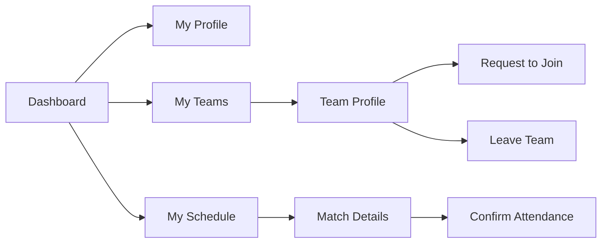
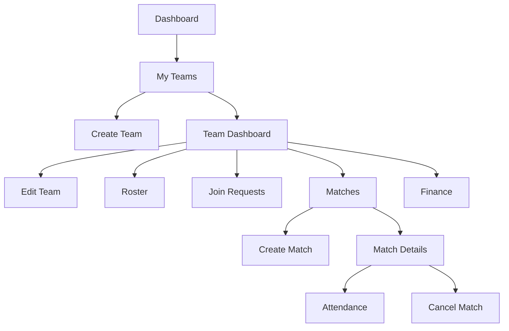
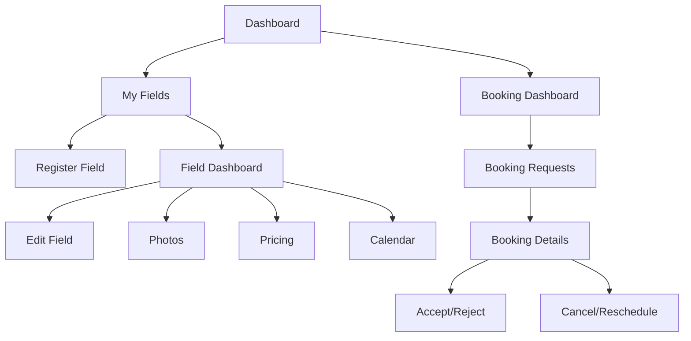
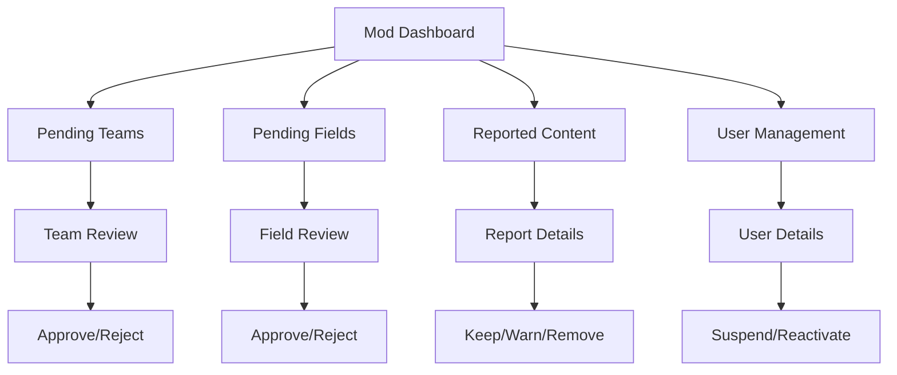

# Kick-off: Football App Sitemap

This sitemap outlines the complete navigation structure for the **Kick-off Amateur Football Management Platform** based on the SRS use cases.

---

## 1. Public Pages (No Authentication Required)

| Page | Path | Description |
|------|------|-------------|
| Landing/Home | `/` | Welcome page with app features, login/register CTAs |
| Login | `/login` | User authentication |
| Register | `/register` | New user registration with role selection |
| Browse Community | `/community` | View public posts (read-only) |
| Search Teams | `/teams` | Browse verified team profiles |
| Search Fields | `/fields` | Browse verified field listings |

---

## 2. Authenticated User Pages (All Roles)

### 2.1 Dashboard & Navigation

| Page | Path | Description |
|------|------|-------------|
| Dashboard | `/dashboard` | Personalized home based on user role |
| Notifications | `/notifications` | List of all notifications |
| Notification Settings | `/settings/notifications` | Customize notification preferences |
| Account Settings | `/settings/account` | Profile & password management |

### 2.2 Community Features

| Page | Path | Description |
|------|------|-------------|
| Community Feed | `/community` | Browse and interact with posts |
| Create Post | `/community/create` | Create a new post (modal/page) |
| Post Details | `/community/posts/:id` | View post with comments |
| Report Content | `/report` | Submit misconduct report (modal) |

### 2.3 Search & Discovery

| Page | Path | Description |
|------|------|-------------|
| Search Teams | `/search/teams` | Search with filters (name, location, skill) |
| Search Fields | `/search/fields` | Search with filters (location, amenities, price) |
| Search Players | `/search/players` | Search with filters (name, position, skill) |
| Search Field Owners | `/search/owners` | Search field owner profiles |
| Team Profile (Public) | `/teams/:id` | View team details, request to join |
| Field Profile (Public) | `/fields/:id` | View field details, photos, pricing |
| Player Profile (Public) | `/players/:id` | View player profile |

---

## 3. Player Pages

| Page | Path | Description |
|------|------|-------------|
| My Profile | `/profile` | Edit personal player profile |
| My Teams | `/my-teams` | List of joined teams |
| Team Details | `/my-teams/:id` | View specific team membership |
| Leave Team | `/my-teams/:id/leave` | Leave team (confirmation modal) |
| My Schedule | `/schedule` | View upcoming & past matches |
| Match Details | `/schedule/:matchId` | View match info, confirm attendance |

### Player Navigation Flow

---

## 4. Team Leader Pages

### 4.1 Team Management

| Page | Path | Description |
|------|------|-------------|
| My Teams | `/leader/teams` | List of teams I lead |
| Create Team | `/leader/teams/create` | Create new team profile |
| Team Dashboard | `/leader/teams/:id` | Team overview & management |
| Edit Team | `/leader/teams/:id/edit` | Edit team profile |
| Team Roster | `/leader/teams/:id/roster` | View/manage team members |
| Join Requests | `/leader/teams/:id/requests` | Approve/reject join requests |
| Delete Team | `/leader/teams/:id/delete` | Delete team (confirmation) |

### 4.2 Match Management

| Page | Path | Description |
|------|------|-------------|
| Match List | `/leader/teams/:teamId/matches` | All matches for this team |
| Create Match | `/leader/teams/:teamId/matches/create` | Schedule a new match (includes field selection) |
| Match Details | `/leader/teams/:teamId/matches/:matchId` | View/edit match |
| Match Invitations | `/leader/teams/:teamId/matches/invitations` | Respond to match invites |
| Match Attendance | `/leader/teams/:teamId/matches/:matchId/attendance` | Track player attendance |
| Cancel Match | `/leader/teams/:teamId/matches/:matchId/cancel` | Cancel match (confirmation) |

### 4.3 Team Finance

| Page | Path | Description |
|------|------|-------------|
| Team Finance | `/leader/teams/:id/finance` | View income/expenses |
| Add Transaction | `/leader/teams/:id/finance/add` | Add income/expense record |

### Team Leader Navigation Flow

---

## 5. Field Owner Pages

### 5.1 Field Management

| Page | Path | Description |
|------|------|-------------|
| My Fields | `/owner/fields` | List of registered fields |
| Register Field | `/owner/fields/create` | Create new field profile |
| Field Dashboard | `/owner/fields/:id` | Field overview |
| Edit Field | `/owner/fields/:id/edit` | Edit field profile |
| Field Photos | `/owner/fields/:id/photos` | Manage field images |
| Field Pricing | `/owner/fields/:id/pricing` | Set pricing structure |

### 5.2 Booking Management

| Page | Path | Description |
|------|------|-------------|
| Booking Dashboard | `/owner/bookings` | Overview of all bookings |
| Booking Requests | `/owner/bookings/requests` | Pending booking requests |
| Booking Calendar | `/owner/fields/:id/calendar` | Calendar view of bookings |
| Booking Details | `/owner/bookings/:id` | View booking details |
| Respond to Booking | `/owner/bookings/:id/respond` | Accept/reject booking |
| Cancel/Reschedule | `/owner/bookings/:id/cancel` | Cancel or reschedule booking |

### Field Owner Navigation Flow

---

## 6. Moderator Pages

### 6.1 Verification Queue

| Page | Path | Description |
|------|------|-------------|
| Moderator Dashboard | `/mod` | Overview of pending items |
| Pending Teams | `/mod/teams` | Teams awaiting verification |
| Team Review | `/mod/teams/:id` | Review & approve/reject team |
| Pending Fields | `/mod/fields` | Fields awaiting verification |
| Field Review | `/mod/fields/:id` | Review & approve/reject field |

### 6.2 Content Moderation

| Page | Path | Description |
|------|------|-------------|
| Reported Content | `/mod/reports` | List of reported content |
| Report Details | `/mod/reports/:id` | Review report & take action |
| Moderation History | `/mod/history` | Log of moderation actions |

### 6.3 User Management

| Page | Path | Description |
|------|------|-------------|
| User List | `/mod/users` | Search/browse users |
| User Details | `/mod/users/:id` | View user profile & history |
| Suspend User | `/mod/users/:id/suspend` | Suspend user (confirmation) |
| Reactivate User | `/mod/users/:id/reactivate` | Reactivate user |

### Moderator Navigation Flow

---

## 7. Common Components & Modals

| Component | Used In | Description |
|-----------|---------|-------------|
| Header/Navbar | All pages | Navigation, user menu, notifications |
| Footer | All pages | Links, copyright |
| Notification Bell | Header | Quick view of recent notifications |
| Search Modal | Header | Global search |
| Report Modal | Community, Profiles | Report misconduct form |
| Confirmation Modal | Delete/Cancel actions | Confirm destructive actions |
| Success/Error Toast | All pages | Feedback messages |

---

## Notes

> Role-based routing should be implemented - users should only see navigation items and access pages relevant to their role(s). A user can potentially have multiple roles (e.g., a Player who is also a Team Leader).

> **Match Creation Flow**: The "Create Match" page (`/leader/teams/:teamId/matches/create`) includes an integrated field selection/search step. This is handled within the page UI, not as a separate route.
